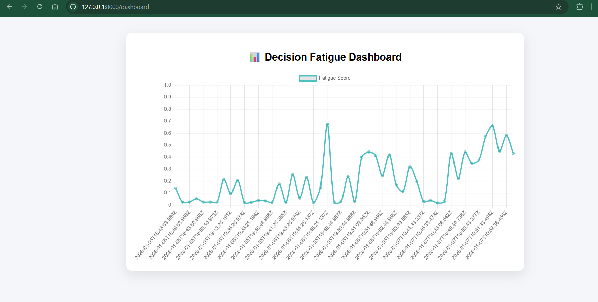

# 🧠 Decision Fatigue Detection System

A privacy-first system that detects **decision fatigue** by observing **behavior patterns over time** (typing, mouse movement, and correction behavior), and delivers **real-time alerts** only when fatigue is sustained — not due to random spikes.

---

## 🚀 Overview

Decision fatigue happens when prolonged mental effort starts affecting judgment and efficiency.  
Instead of asking users questions or running surveys, this system **infers fatigue passively** from natural interaction signals.

The idea is simple:
> Human fatigue is gradual and contextual — so detection should be too.

---

## 🎯 Core Ideas Behind the System

- **Context over noise** – no alerts for one-off spikes
- **Time-aware detection** – fatigue builds over time
- **Privacy-first** – no raw text or key content stored
- **Explainable logic** – not a black box model

---

## 🏗️ System Architecture

Browser Extension  
→ Feature extraction (1-minute windows)  
→ FastAPI backend  
→ Rule-based + ML scoring  
→ Score fusion  
→ Alert logic  
→ On-screen alert

---

## 📊 Dashboard Preview

The dashboard visualizes decision fatigue over time using real user interaction data.
Each point represents an aggregated behavioral window, helping identify fatigue build-up
and recovery phases.

**What this shows:**
- Y-axis: Normalized fatigue score (0 → 1)
- X-axis: Time (sliding behavioral windows)
- Spikes indicate sustained cognitive load
- Gradual decay reflects recovery behavior

## 📊 Behavioral Features Collected

Only aggregated metrics are collected — never raw keystrokes or text.

| Feature | Description |
|------|-----------|
| typing_speed | Average typing rate |
| typing_variance | Variation in typing rhythm |
| backspace_rate | Frequency of corrections |
| backspace_burst_rate | Rapid correction bursts |
| ctrl_z_rate | Undo frequency |
| mouse_speed | Cursor movement speed |
| mouse_distance | Total cursor movement |
| window_duration | Time window length (seconds) |

Each window represents **60 seconds of activity**.

---

## 🧮 Step 1: Personal Baseline

Before detecting fatigue, the system learns what *normal behavior* looks like for each user.

For every feature:
- Mean (μ)
- Standard deviation (σ)

This makes detection **relative to the user**, not a generic average.

---

## 🧮 Step 2: Rule-Based Fatigue Score

Each feature deviation is converted into a normalized score using a z-score:

z = |x − μ| / σ  

Values are capped to avoid overreaction, and then combined using weighted importance.

This produces an **interpretable fatigue score between 0 and 1**.

---

## 🤖 Step 3: Autoencoder (Instant Anomaly Detection)

A neural autoencoder is trained on normal behavior.

- It learns to reconstruct typical feature patterns
- High reconstruction error means behavior is unusual

This helps detect sudden anomalies without needing labels.

---

## ⏳ Step 4: LSTM Autoencoder (Temporal Patterns)

This is where the system becomes context-aware.

Instead of looking at single moments, the LSTM:
- Observes **sequences of recent windows**
- Learns what normal behavior looks like over time
- Flags fatigue only when abnormal patterns persist

In simple terms:
> The LSTM remembers recent behavior and checks if the *pattern* feels off — not just one moment.

---

## 🔀 Step 5: Score Fusion

Final fatigue score is calculated using a weighted combination:

- Rule-based score → explainability
- Autoencoder score → quick anomaly detection
- LSTM score → sustained temporal context

This balances transparency and intelligence.

---

## 🚨 Step 6: Alert Logic

Alerts are shown only when:
- Fatigue is above threshold
- It persists across windows
- Cooldown time has passed

Alerts are:
- Non-intrusive
- Respectful
- Actionable

Example:
> ⚠️ You may be experiencing decision fatigue.  
> A short break could help 🧠

---

## 🧪 Testing & Debugging

- Backend tested via manual POST requests
- Frontend tested using debug triggers and forced alerts
- Test thresholds allow instant validation without long typing sessions

---

## 🗄️ Data Storage

- Uses SQLite
- Stores:
  - Aggregated features
  - Fatigue scores
- Does **not** store:
  - Typed text
  - Key values
  - Personal identifiers

---

## 🔐 Privacy & Ethics

- No surveillance
- No content logging
- No behavioral profiling across users
- Designed for user well-being, not productivity policing

---

## ✅ Current Status

✔ Feature extraction  
✔ Backend API  
✔ Rule-based scoring  
✔ Autoencoder model  
✔ LSTM temporal model  
✔ Score fusion  
✔ Alert system  
✔ Debug & testing tools  
✔ Dashboard visualization  

---

## 🔜 Possible Next Steps

- User-tunable sensitivity
- Long-term fatigue trends
- Mobile-friendly version
- Optional cloud hosting
- Local-only inference mode

---

## 🏁 Final Thought

Decision fatigue is subtle.  
This system treats it that way.

It doesn’t interrupt — it **understands**, then gently nudges.

